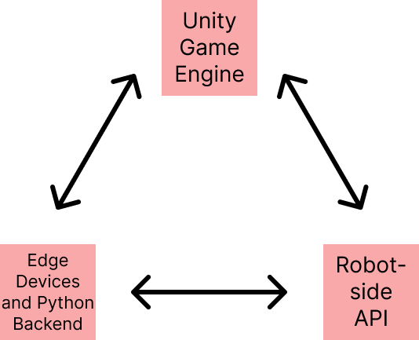
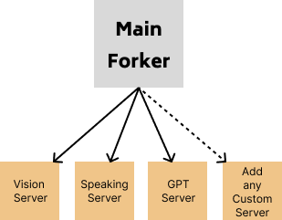

# GO1_GPT_UNITY
# Codebase Overview and Setup Instructions

## High-Level Architecture

This codebase configures scripts for:
- Robot control
- Edge sensor communication
- BIM (Building Information Modeling) integration

The architecture involves communication between:
1. Unity Game Engine: Handles navigation and robot control through BIM
2. Python backend: Manages inner communications between APIs and processes
3. Go1 API: Provides robotic control



## Communication Architecture

- Uses a generic client-server architecture
- Modular setup allows addition of custom scripts on separate processes
- Separate processes prevent overload and slowdown of a single process
- Python forker starts these processes on launch


## Current Implementation

The current setup works with:
- Edge camera for activity recognition and autonomous data labeling
- OpenAI ChatGPT API
- ElevenLabs API for text-to-speech
- Microphone with Google TTS for speech-to-text

## Setup Instructions

1. SSH into the Unitree

2. Start the main server:
 ```
python3 go_srv.py
 ```
3. In a separate terminal, run the YOLO server:
 ```
python3 yolo_internal_srv.py
 ```

4. Run the listen server (choose one method):
- Add `listen_srv.py` to the forker, OR
- Run in a separate terminal:
  ```
  python3 listen_internal_srv.py
  ```

5. Run the main file:

 ```
main_unitree.py
 ```